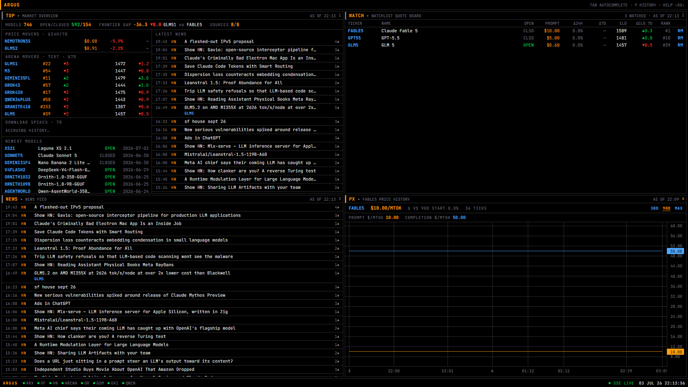
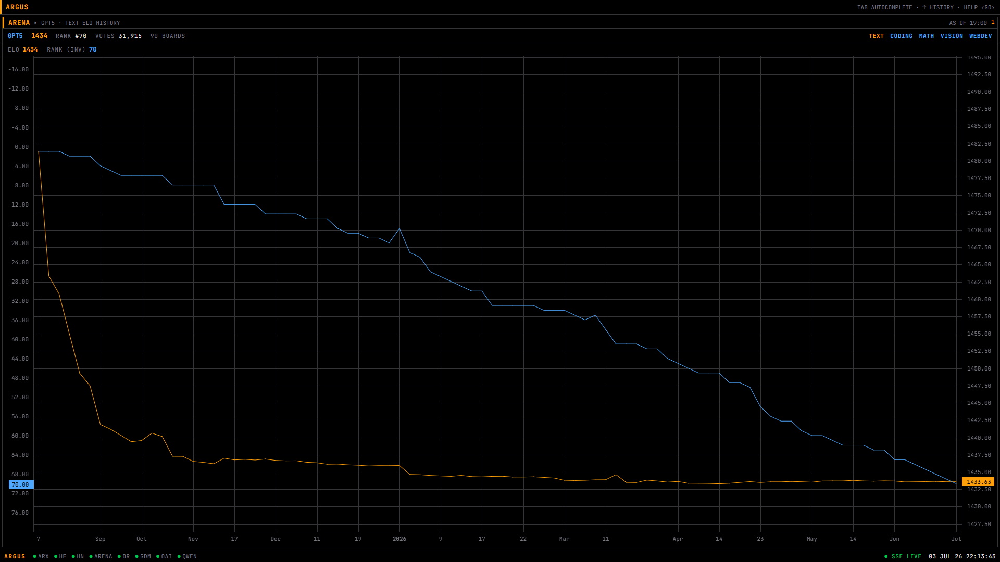

# ARGUS

> **[ demo GIF placeholder — cold boot → TOP live → FABLE5 DES → PX 90D → ARENA CODING → LAYOUT 4 ]**

**A Bloomberg-style terminal for the AI model ecosystem** — real-time pricing, arena rankings, benchmarks, and news for ~750 LLMs, operated through a keyboard-first command line.

The data Argus displays already exists — scattered across Artificial Analysis, LMArena, HuggingFace, OpenRouter, and a dozen lab blogs. But all of it is packaged as *websites you browse*. Argus packages it as a *terminal you operate*: mnemonic commands, multi-panel layouts, watchlists, two years of historical charts, and a unified entity model, built for people who track the AI model market the way traders track equities. The incumbents are dashboards; Argus is a workstation.



## Functions

Grammar: `[ENTITY] FUNCTION [ARGS] ‹GO›` — entity-first (`FABLE5 DES`) or function-first (`DES FABLE5`); a bare entity opens DES; `Enter` executes into the focused panel.

| Function | Usage | What it does |
|---|---|---|
| `TOP` | `TOP` | Market overview — movers, frontier gap, latest news |
| `DES` | `FABLE5 DES` | Model spec sheet: identity, pricing, capabilities, standings, news |
| `PX` | `FABLE5 PX 90D` | Token price history chart (`30D\|90D\|MAX`) |
| `ARENA` | `ARENA TEXT` / `FABLE5 ARENA CODING` | Leaderboard, or one model's ELO/rank history |
| `BENCH` | `BENCH FABLE5 GPT55 GLM5` | 2–5 model comparison matrix, best-in-row highlighted |
| `NEWS` | `NEWS FABLE5` | Dense news feed, optionally filtered by model |
| `MKT` | `MKT OPEN` | Full market table, ~750 rows, sortable, virtualized |
| `MOV` | `MOV` | Movers detail: price cuts, rank jumps, download spikes |
| `WATCH` | `WATCH ADD FABLE5` | Persistent watchlist with a live quote board |
| `STAT` | `STAT` | Source health, poll cadences, row counts — plumbing on display |
| `LAYOUT` | `LAYOUT 4` | 1/2/4-panel grid; `Alt+1–4` focuses a panel |
| `HELP` | `HELP` | Full reference, generated from the command registry |

Keyboard: `/` or `Ctrl+K` focuses the command line from anywhere · `Tab` accepts ghost-text autocomplete · `↑/↓` history · `Esc` clears · errors render inline in the bar, never as modals.



## Architecture

```
                      ┌──────────────────────────────────────────────┐
                      │                  SERVER (Hono)               │
                      │                                              │
  OpenRouter API ──┐  │  ┌──────────┐   ┌────────────┐   ┌────────┐  │
  HF Hub API ──────┤  │  │ Pollers  │──▶│ Normalizer │──▶│ SQLite │  │
  LMArena dataset ─┼──┼─▶│ (per-src │   │ (zod → uni-│   │ (WAL)  │  │
  arXiv API ───────┤  │  │ cadence) │   │ fied model)│   └───┬────┘  │
  HN Algolia ──────┤  │  └──────────┘   └────────────┘       │       │
  Lab RSS feeds ───┘  │        │                             │       │
                      │        ▼                             ▼       │
                      │  ┌──────────┐              ┌───────────────┐ │
                      │  │ Scheduler│              │ REST API + SSE│ │
                      │  └──────────┘              └───────┬───────┘ │
                      └────────────────────────────────────┼─────────┘
                                                           │
                                              ┌────────────▼────────────┐
                                              │        WEB (React)      │
                                              │  Command line ▸ Router  │
                                              │  Panel grid ▸ Functions │
                                              └─────────────────────────┘
```

Four ideas carry the design:

1. **Snapshot history.** Every poll writes immutable snapshot rows (price, rank, downloads at time T) into SQLite with composite natural keys. Time series are just `SELECT`s — that's what makes `PX` and `ARENA` charts possible, and it's the most market-data-like property of the system. The arena table holds ~18k rows spanning August 2024 to today, backfilled from the LMArena historical dataset on first boot.

2. **The entity resolver.** Every upstream names models differently (`anthropic/claude-fable-5` vs `claude-fable-5` vs "Claude Fable 5" vs dash-spelled versions with date stamps). A unit-tested resolver canonicalizes through exact/alias/deterministic-rule/fuzzy tiers — and **quarantines** what it can't safely attach rather than corrupting the entity table. Unresolvable rows are a feature, not a bug: they're visible in `STAT`.

3. **Degrade per source, never crash.** Each poller has its own cadence, backoff, and health row. One malformed row is skipped with a log line; one dead source goes stale in the status bar (Bloomberg-style) while everything else keeps ticking. Stale data is always labeled, never hidden and never blank.

4. **SSE, not WebSockets.** Data cadence is minutes-to-daily. After each poll the server emits compact change events (just-changed model ids per facet); panels refetch and flash exactly the cells that moved. Clients heartbeat-watchdog the stream and resync on every reconnect, so missed events can't strand a panel on stale data.

The browser never talks to external APIs — all polling is server-side, normalized once, served through one internal API with a consistent `{data, asOf, stale?}` envelope.

## Quickstart

```bash
git clone https://github.com/ManeeshJupalle/ARGUS.git
cd ARGUS
npm install
npm run seed     # loads bundled fixtures — full terminal, no network needed
npm run dev      # server :3001 + web :5173
```

Open http://localhost:5173 — you land on a populated TOP screen immediately; live polling catches the data up in the background within minutes.

> **Note (npm ≥ 11):** newer npm versions gate dependency install scripts. This repo ships an `allowScripts` approval for `better-sqlite3` and `esbuild` in `package.json`, but if your npm still warns at install time (e.g. after a dependency bump changes versions), run
> `npm approve-scripts better-sqlite3 esbuild` and re-run `npm install`. Without the native `better-sqlite3` build step the server cannot start.

Docker path:

```bash
docker compose up    # seeds on first boot → http://localhost:5173
```

Other scripts: `npm run smoke` (fresh-clone simulation: checkout → install → seed → boot → API assertions → teardown) · `npm test` (resolver + command-parser suites, the two designated hard components) · `npm run reset` (wipe and rebuild the DB).

## Honest limitations

- **Coverage bias.** The entity universe is OpenRouter-derived (~340 API-served models) plus the HuggingFace top-500 open-weight long tail. Models absent from both — mostly retired ones (vicuna-era, PaLM-era) — quarantine by design: the Arena resolver's real-world match rate is ~44%, and that number is honest. The quarantine table is inspectable via `STAT`.
- **Arena cadence and history.** LMArena publishes daily. The two-year backfill covers the text/vision/webdev overall boards; sub-category history (coding, math, …) only accrues from your install date, so `FABLE5 ARENA CODING` charts start thin and say so.
- **Young installs show `ACCRUING HISTORY…`.** Price movers need ≥24h of price snapshots; download spikes need ≥24h of hub snapshots. The panels label the wait instead of faking deltas.
- **News skews HN-recent.** Of the eight labs targeted, only OpenAI, Google DeepMind, and Qwen publish working public RSS feeds — Anthropic, Meta AI, Mistral, xAI, and DeepSeek had none at build time (every candidate URL 404'd; documented in `rss.ts`). Those labs are covered indirectly through Hacker News and arXiv.
- **Ticker collisions get numeric suffixes.** `openai/gpt-5.1-chat` becomes `GPT512` because `GPT51` was taken — a known wart. `shared/src/tickers.json` is the checked-in override map for hand-tuning.
- **Single-user, local-first, no auth — by design.** The watchlist is a local SQLite table; there are exactly two write endpoints in the entire app (watchlist add/remove).

## Attribution

- Charts: [TradingView lightweight-charts](https://github.com/tradingview/lightweight-charts) (Apache-2.0). The on-canvas logo is disabled per its documentation; this notice is the attribution.
- Data: [OpenRouter](https://openrouter.ai) (pricing/catalog), [LMArena](https://lmarena.ai) via the `lmarena-ai/leaderboard-dataset` on HuggingFace (arena ELO), [HuggingFace Hub](https://huggingface.co) (downloads/likes/licenses), [arXiv](https://arxiv.org) (papers), [HN Algolia](https://hn.algolia.com) (news), and the OpenAI / Google DeepMind / Qwen blog feeds.

## Stack

npm workspaces monorepo (`shared` / `server` / `web`) · Node 20+ · TypeScript strict everywhere · **Hono** + **better-sqlite3** (WAL) + **zod** at every external boundary · **React 18** + **Vite** + **zustand** · **lightweight-charts** · **vitest** (resolver + parser suites) · plain CSS modules with a single design-token file — no UI framework, no Tailwind.

## License

MIT © ManeeshJupalle
